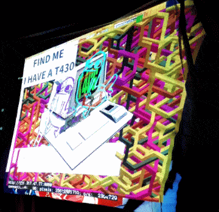

# PixelFlutHexSnakes
Snake like patterns moving in a hexagonal pattern for defnull's [Pixelflut](https://github.com/defnull/pixelflut)

made on 34C3

Python 2.7.11

(Automatic connection restart for spotty wifi doesn't work, use ethernet instead)

